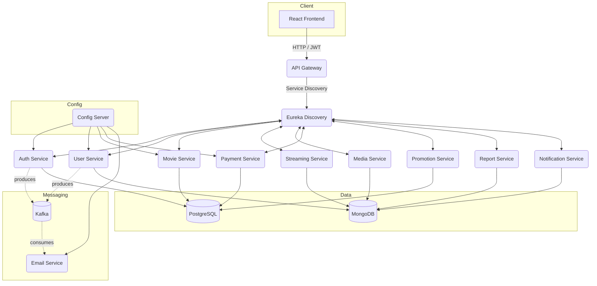

# NovaPlay 🎬 — Microservices Movie Streaming Platform

> **Slogan:** Immersive movie experiences delivered through a production-grade microservices architecture.

<p align="center">
  
</p>

<p align="center">
  <a href="https://github.com/your-username/your-repo/actions"></a>
  <a href="https://codecov.io/gh/your-username/your-repo"></a>
  <a href="LICENSE"></a>
  
</p>

---

## 📚 Table of Contents

1. [Introduction](#-introduction)
2. [Key Features](#-key-features)
3. [Tech Stack](#-tech-stack)
4. [System Architecture](#-system-architecture)
5. [Installation](#-installation)
6. [Configuration](#-configuration)
7. [Usage](#-usage)
8. [Running Tests](#-running-tests)
9. [Contributing](#-contributing)
10. [License](#-license)
11. [Author & Contact](#-author--contact)

---

## 🧭 Introduction

NovaPlay is a scalable movie streaming application powered by a Java-based microservices architecture. It provides a robust blueprint for engineering resilient, event-driven systems, making it an ideal learning platform for backend developers exploring cloud-native technologies and distributed computing patterns.
**Why NovaPlay?**

- 🎯 **Focus on real-world scenarios:** API Gateway, service discovery, centralized configuration, observability, CI/CD, and strict separation of concerns.
- ⚙️ **Optimized synchronous communication:** Inter-service REST calls handled by OpenFeign with resilient patterns (timeouts, retries, circuit breakers).
- ✉️ **Kafka for email workflows only:** Keeps the asynchronous scope focused and debuggable while preserving rapid responses for core APIs.
- 👥 **Audience:** Backend engineers exploring microservices, DevOps practitioners testing delivery pipelines.

---

## 🌟 Key Features

- **Comprehensive product & catalog management:** Handle movies, genres, casts, and personalized recommendations.
- **Real-time cart & payment flows:** Manage subscription upgrades, checkout, and webhook validations.
- **Secure authentication & authorization:** OAuth2/JWT-based identity, role-based access, and rate limiting via the gateway.
- **Email-driven engagements:** Kafka-triggered transactional emails (registration, password reset) consumed by the email service.
- **Media ingestion & streaming:** Asset upload, transcoding orchestration, and adaptive streaming delivery.
- **Observability out of the box:** Metrics, distributed tracing, and structured logging for every service.

---

## 🧰 Tech Stack

- **Backend:** Java 21, Spring Boot 3, Spring Cloud Gateway, Spring Security, OpenFeign, Resilience4j.
- **Databases & Storage:** PostgreSQL, MongoDB, MySQL, Redis (caching/OTP), S3-compatible object storage.
- **Message Broker:** Apache Kafka (scoped to email-service flows).
- **DevOps & Tooling:** Docker, Docker Compose, GitHub Actions, Grafana/Prometheus/Tempo, Loki.
- **Frontend:** React, Vite, Redux Toolkit, Tailwind CSS.
- **Testing:** JUnit 5, Mockito, Testcontainers.

---

## 🏗 System Architecture

NovaPlay embraces a microservices architecture with clear bounded contexts and an API Gateway fronting all client access. Configuration is centralized, synchronous communication uses OpenFeign over REST, and Kafka is intentionally limited to email workflows to reduce operational complexity.



---

## ⚙️ Installation

1. **Clone the repository:** `git clone https://github.com/81quanghuy/NovaPlay.git`
2. **Navigate to the project:** `cd NovaPlay`
4. **Copy environment template:** `cp docker-compose/.env.example .env`
5. **Start infrastructure (databases, Kafka, monitoring):** `docker-compose up -d`
6. **Build all modules:** `./mvnw clean install`
7. ** Run services:** Use the provided scripts or run via IDE.
7. **(Optional) Build frontend assets: https://github.com/81quanghuy/NovaPlay_FE.git **
  - `cd NovaPlay_FE`
  - `npm install`
  - `npm run dev` (for development)
  - Copy the built assets to the appropriate location for serving.
---

## 🛠 Configuration

Define the following environment variables (or entries in your centralized configuration repository):

| Variable | Description |
|----------|-------------|
| `SPRING_PROFILES_ACTIVE` | Active profile (`dev`, `stage`, `prod`) for each service. |
| `CONFIG_GIT_URI` | Git repository URL storing shared configuration for the Config Server. |
| `DATABASE_URL` | JDBC connection string for PostgreSQL-backed services (auth, user). |
| `MONGODB_URI` | MongoDB connection string for the movie catalog. |
| `MYSQL_URL` | JDBC connection for payment/promotion services. |
| `REDIS_HOST` | Redis endpoint used for caching, OTP, and rate limiting. |
| `KAFKA_BROKER_URL` | Bootstrap servers for Kafka (used strictly for email workflows). |
| `JWT_SECRET_KEY` | Symmetric key for signing JWT tokens. |
| `SMTP_HOST` / `SMTP_API_KEY` | Credentials for the email service provider. |
| `FRONTEND_BASE_URL` | Public URL of the frontend used when generating deep links. |

> 💡 Store secrets using Vault, AWS Secrets Manager, or GitHub Actions secrets. Never commit sensitive values.

---

## 🚀 Usage

- **Start services (dev mode):**
  - `./mvnw spring-boot:run -pl discovery-server`
  - `./mvnw spring-boot:run -pl cloud-config`
  - `./mvnw spring-boot:run -pl api-gateway`
  - `./mvnw spring-boot:run -pl auth-service,user-service,movie-service,streaming-service,media-service,email-service,payment-service,promotion-service,report-service`
- **Access the frontend:** `cd ui && npm run dev`
- **API documentation:** Swagger UI aggregated at `http://localhost:8072/swagger-ui.html` via the gateway.

---

## ✅ Running Tests

```bash
./mvnw test
```

For integration tests that require containers (PostgreSQL, MongoDB, Kafka), ensure Docker is running locally. Use `./mvnw verify -Pintegration-tests` to execute the full suite.

---

## 👤 Author & Contact

- **Name:** Ngô Diệp Quang Huy
- **Email:** novaplay@novaplay.io.vn
- **GitHub:** [@81quanghuy](https://github.com/81quanghuy)
- **LinkedIn:** [linkedin.com/in/huyndq](https://www.linkedin.com/in/huyndq)

> 💬 Feel free to reach out for collaborations, mentorship, or feedback on NovaPlay!

---

**Happy streaming and happy coding!** ✨
